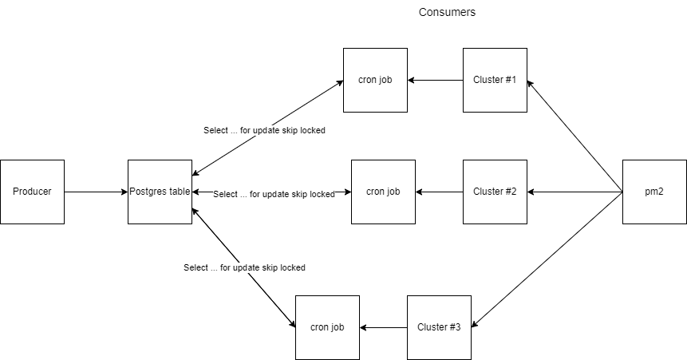

# Postgres-queue
This project implements a queue service (like kafka and rabbitMQ) using a Postgresql instance as broker. A producer sends a new order to the Order table, but the API is running in several clusters, and each cluster has a cron job running every minute that work as consumer, processing a row from the Order table.

## How do this works?
When the cron job get the pending orders the select query is made by using two clausules from Postgresql: [FOR UPDATE](https://www.postgresql.org/docs/9.0/sql-select.html#SQL-FOR-UPDATE-SHARE) and [SKIP LOCKED](https://www.postgresql.org/docs/current/sql-select.html).

The `FOR UPDATE` causes the rows retrieved by the `SELECT` statement to be locked as though for update, and the `SKIP LOCKED` skips any selected rows that cannot be immediately locked, then all rows that is being processed by another job on another cluster is not touched by the current job.

## How to run
1. Run the command `npm install`
2. Run the command `npm start`
3. Send a order to the Order table by making a `POST` to `/order`